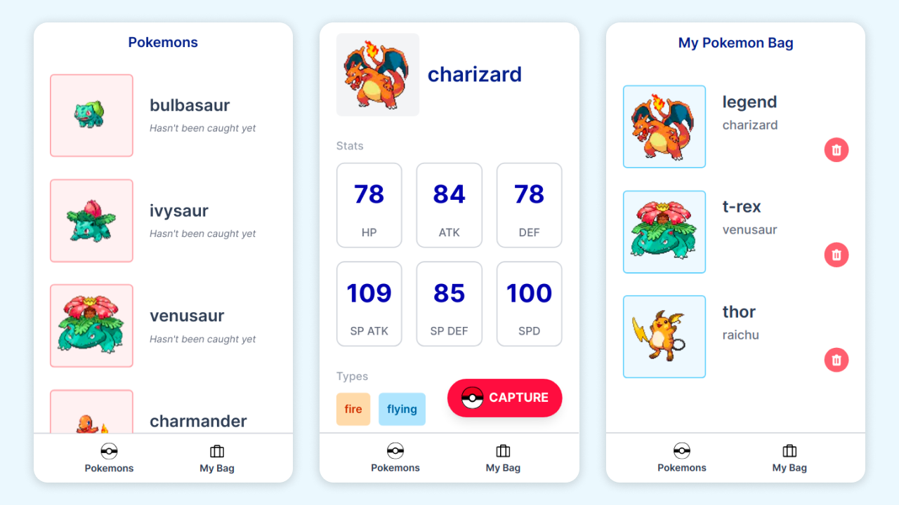

# Pokedex

This is a pokedex application that lists all pokemon through [graphql-pokeapi](https://github.com/mazipan/graphql-pokeapi). This app can also run a pokemon capture simulation and you can give a nickname to it. You can keep your captured pokemons forever.

## Tech-stack:

1. [create-next-app](https://github.com/vercel/next.js/tree/canary/packages/create-next-app)
1. [Apollo](https://www.apollographql.com/)
1. [emotion](https://github.com/emotion-js/emotion)
1. [twin.macro](https://github.com/ben-rogerson/twin.macro)
1. [tailwindcss](https://github.com/tailwindlabs/tailwindcss)
1. [jest](https://github.com/facebook/jest)
1. [cypress](https://github.com/cypress-io/cypress)
1. [react-testing-library](https://github.com/testing-library/react-testing-library)
1. [react-router](https://github.com/ReactTraining/react-router)
1. [vercel](https://vercel.com/)

## implemented test:

- [x] Capture a pokemon and give it a nickname (e2e with cypress)
- [x] Release a captured pokemon (e2e with cypress)
- [x] Display pokemon detail (unit test, with mocked graphql response)
- [x] Display pokemon list (unit test, with mocked graphql response)
